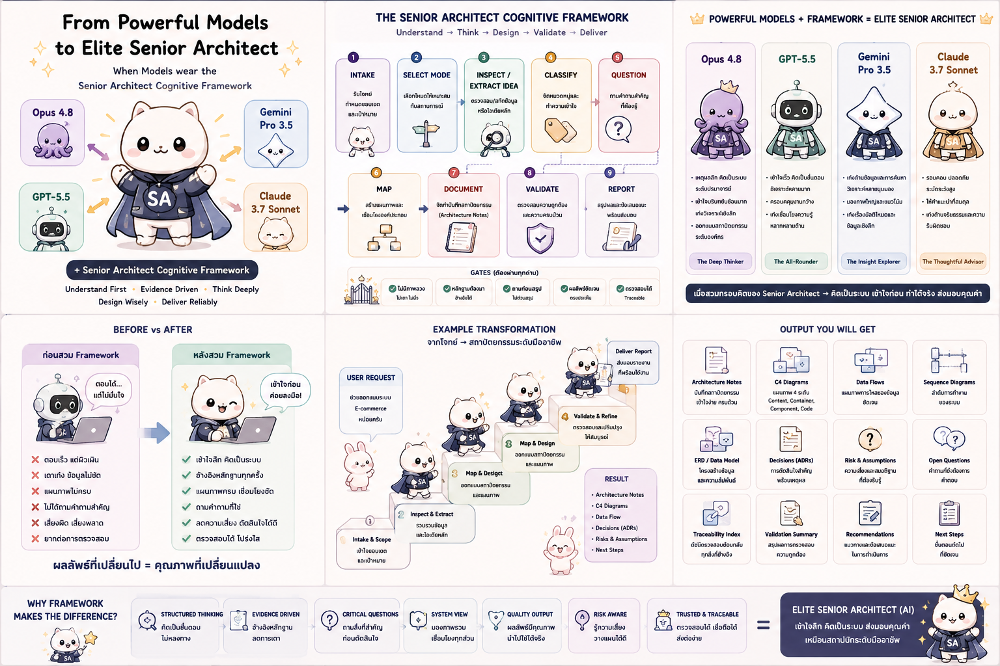
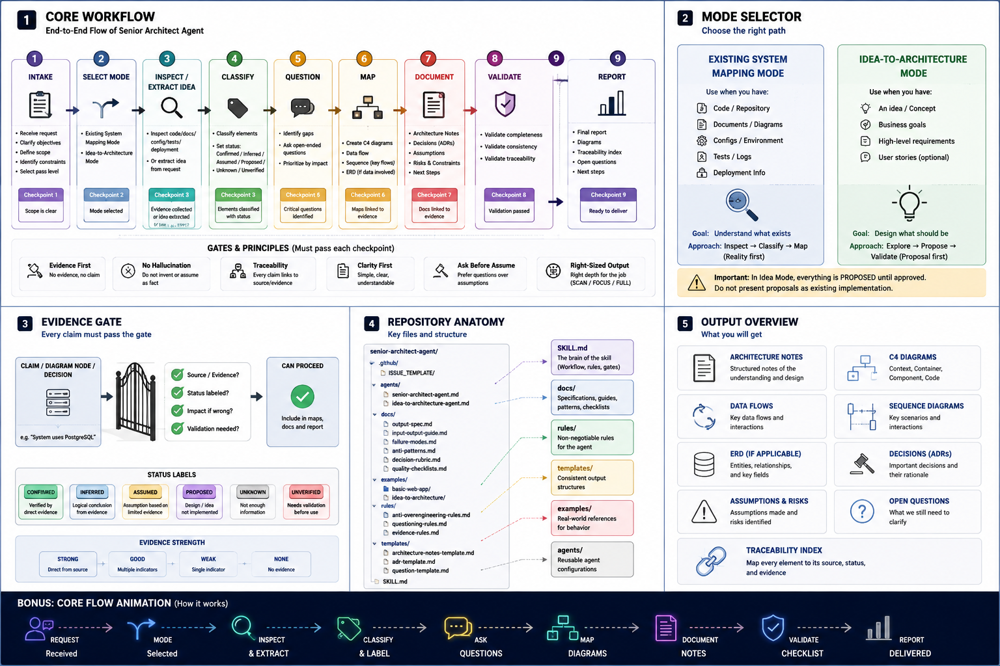
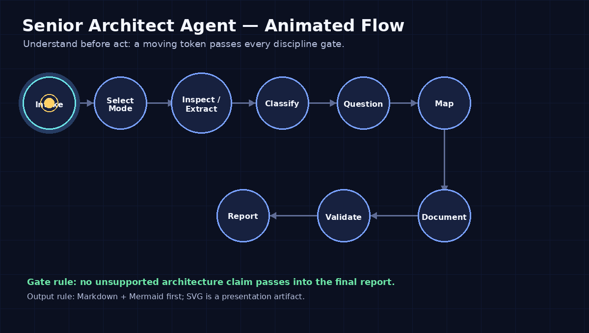

# senior-architect-agent

Current release: `v1.1.0 - Right-Sized Architecture Passes`

Senior Architect Agent is an AI architecture skill for existing system mapping,
software architecture documentation, architecture mapping, Mermaid diagrams,
and AI agent handoff.

This project is a reusable AI agent skill that forces an agent to inspect,
understand, question, map, document, and validate a software system or raw
system idea before suggesting architecture changes or editing code.

Search terms this repository is meant to serve: `Senior Architect Agent`,
`AI architecture skill`, `architecture mapping`, `existing system mapping`,
`software architecture documentation`, `Mermaid architecture diagram`, and
`AI agent handoff`.

Main slogan:

> This skill does not make AI code faster. It makes AI understand before it acts.

Expanded direction:

> This skill helps AI agents unfold existing systems and raw ideas into
> architecture maps that humans and future AI agents can understand, review,
> and continue from.

<p align="center">
  <a href="assets/visuals/from_powerful_models_to_elite_architects.png">
    
  </a>
  <br>
  <strong>From powerful models to elite senior architects</strong>: the skill
  adds a disciplined cognitive framework around capable models.
</p>

<p align="center">
  <a href="assets/visuals/senior_architect_agent_workflow_infographic.png">
    
  </a>
  <br>
  <strong>Full workflow infographic</strong>: core flow, mode selection,
  evidence gates, repository anatomy, and expected outputs.
</p>

<p align="center">
  <a href="assets/visuals/senior_architect_agent_core_flow.gif">
    
  </a>
  <br>
  <strong>Core flow animation</strong>: inspect evidence, classify claims,
  ask before mapping, then deliver traceable architecture output.
</p>

## Purpose

AI agents often edit code before they understand the architecture. They also
turn raw ideas into confident designs too early.

This skill adds a discipline layer:

1. Inspect the real system first.
2. Preserve user intent when no system exists yet.
3. Separate confirmed facts, proposed architecture, assumptions, inferences,
   open questions, risks, and decisions.
4. Ask architecture-impacting questions before finalizing conclusions.
5. Produce useful Markdown and Mermaid architecture maps.
6. Leave handoff notes that future AI agents can use quickly.
7. Avoid unsupported claims, decorative documentation, and overengineering.

## Use When

- An AI agent must map an existing codebase or software system.
- A project needs architecture documentation before code changes.
- A team needs module maps, workflow maps, data-flow notes, or Mermaid diagrams.
- A future AI agent needs handoff notes, risks, unknowns, and safe next actions.
- A raw idea is connected to an existing system or broader architecture review.

## Do Not Use When

- The task is a pure raw idea with no existing implementation and
  `$idea-to-architecture-agent` is available.
- The user only needs a small implementation fix with no architecture impact.
- The output would become decorative documentation rather than useful context.

## Operating Modes

### Existing System Mapping Mode

Use this mode when project files, codebase structure, or existing documentation
are available.

The agent inspects what exists, maps real boundaries and responsibilities, and
marks uncertainty instead of inventing missing architecture.

### Idea-to-Architecture Mode

Use this mode when the user provides a raw idea, product concept, feature
request, or business/system goal without an implementation.

The agent asks architecture-impacting questions, preserves the user's intent,
states assumptions, and produces a reviewable proposal. All modules, workflows,
data models, and integrations remain proposed until approved.

## Related Skill Routing

When [`$idea-to-architecture-agent`](https://github.com/aetox-skills/idea-to-architecture-agent)
is available, prefer it for pure raw ideas with no implementation context.

Use this skill for existing systems, mixed existing-system and proposal work,
architecture boundaries, risk review, handoff notes, or when the dedicated idea
skill is not installed. The sibling skill is optional; this project does not
depend on it.

Related skill:

- [`idea-to-architecture-agent`](https://github.com/aetox-skills/idea-to-architecture-agent):
  focused proposal discipline for raw ideas, product concepts, feature
  requests, and business/system goals without an existing implementation.

## Release Direction

`v1.0.0` established flagship content readiness:

1. Define a strict, practical `SKILL.md` for both operating modes.
2. Provide an operating workflow covering intake, mode selection,
   inspection or idea extraction, classification, questioning, mapping,
   documentation, validation, and reporting.
3. Add compact rule files that prevent common AI agent failure modes.
4. Add reusable templates for architecture outputs.
5. Include small examples for existing-system mapping and idea-to-architecture
   proposal behavior.
6. Provide optional skill interface metadata without making the core skill
   depend on it.
7. Include SVG visual artifacts generated from Mermaid example diagrams when
   they help review or presentation.

This is content readiness for a skill: Markdown architecture docs, Mermaid
diagram sources, optional SVG visual artifacts, rules, templates, and examples.

`v1.1.0` adds right-sized architecture pass control:

- `Scan Mode` for compact architecture notes.
- `Focus Mode` for scoped module, workflow, subsystem, or boundary work.
- `Full Mode` for whole-system mapping, future-agent handoff, unclear
  ownership, 3+ interacting modules, persistence, integrations, payment,
  authentication, security, deployment, or major workflow changes.

The skill starts with the smallest safe pass and promotes only when scope,
evidence, risk, or handoff needs require it.

## File Tree

```txt
senior-architect-agent/
  README.md
  SKILL.md
  INSTALL.md
  LICENSE
  CHANGELOG.md

  assets/
    visuals/
      from_powerful_models_to_elite_architects.png
      senior_architect_agent_workflow_infographic.png
      senior_architect_agent_core_flow.gif
      01_core_workflow.mmd

  scripts/
    build_core_flow_gif.py

  agents/
    openai.yaml

  adapters/
    agents-md/
      AGENTS.example.md

  docs/
    philosophy.md
    workflow.md
    output-spec.md
    diagram-guidelines.md
    question-framework.md
    anti-patterns.md
    model-requirements.md
    project-core-th-final.md

  rules/
    inspection-rules.md
    question-rules.md
    documentation-rules.md
    diagram-rules.md
    anti-overengineering-rules.md
    agent-handoff-rules.md

  templates/
    architecture-overview.md
    system-boundary.md
    module-map.md
    data-flow.md
    workflow-map.md
    file-responsibility-map.md
    open-questions.md
    risk-register.md
    ai-agent-notes.md
    decision-record.md
    idea-brief.md
    architecture-proposal.md
    module-proposal.md
    workflow-proposal.md
    data-model-draft.md
    decision-options.md

  examples/
    basic-web-app/
      input-context.md
      output/
        architecture-overview.md
        system-boundary.md
        module-map.md
        data-flow.md
        workflow-map.md
        file-responsibility-map.md
        risk-register.md
        diagram.mmd
        diagram.svg
        open-questions.md
        ai-agent-notes.md
    idea-to-architecture/
      input-context.md
      output/
        idea-brief.md
        open-questions.md
        architecture-proposal.md
        module-proposal.md
        workflow-proposal.md
        data-model-draft.md
        risk-register.md
        diagram.mmd
        diagram.svg
        ai-agent-notes.md
```

## How To Use

Use this skill when an AI agent is asked to understand a codebase, plan
architecture changes, review system structure, document architecture, create
handoff notes, propose redesigns, or turn a raw idea into an architecture
proposal.

When files exist, the agent should not begin with code edits. It should inspect
the project, classify what exists, ask important questions, map the system,
document confirmed facts and uncertainty, then report safe next steps.

Agents may use available inspection tools such as file search, file tree
inspection, git history, validators, and Mermaid checks. Tool output is
evidence to interpret, not architecture by itself.

When only an idea exists, the agent should not pretend a system exists. It
should clarify intent, mark assumptions, propose architecture, identify
tradeoffs, and list decisions requiring approval.

## Model Requirements

This skill is intended for models that can hold long context, follow
instructions across multiple gates, and reason through evidence before
reporting.

For normal use, prefer a model with at least 128K context and strong
instruction following. Use 32K only for small `Scan Mode` tasks. Use 200K or
more for large multi-service or multi-repo systems.

This skill is designed for models that can think through architecture gates,
not just produce quick summaries. See [Model Requirements](docs/model-requirements.md).

## Preferred Outputs

Use Markdown first. Use Mermaid diagrams when diagrams help.

Mermaid is the editable source of truth for diagrams.

SVG visual artifacts may be included when they make architecture easier to
review or present. SVG files are generated artifacts and must not replace
Markdown and Mermaid as source of truth.

`agents/openai.yaml` is lightweight interface metadata only. The core skill
does not depend on it.

## Example Outputs

- Existing system example:
  [`examples/basic-web-app/output/`](examples/basic-web-app/output/)
- Idea-to-architecture example:
  [`examples/idea-to-architecture/output/`](examples/idea-to-architecture/output/)

## Install

See [INSTALL.md](INSTALL.md) for Codex, Claude Code, Antigravity, AGENTS.md,
and manual installation notes.

Install this Codex skill from:

```txt
aetox-skills/senior-architect-agent
```

## License

MIT
