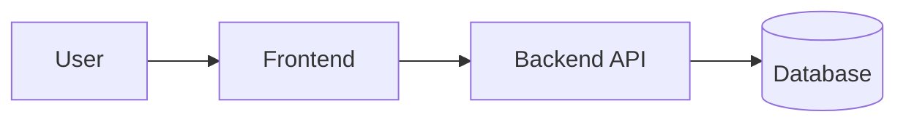

# Diagram Guidelines

Diagrams should clarify architecture, not decorate documentation.

## Default

Use Mermaid as the first diagram format when a diagram is needed.

Generate diagrams only when requested, required for handoff, or needed to
clarify cross-module relationships.

Good diagram candidates:

- System boundary
- Module relationships
- Data movement
- User or background workflows
- Request lifecycle

## Rules

1. Every node should represent a real concept from inspected files or user context.
2. Label inferred nodes as inferred in the surrounding text.
3. Keep diagrams small enough to read.
4. Avoid showing implementation details that do not affect architecture.
5. Do not create fantasy architecture.
6. Do not show backend, database, AI, infrastructure, or external services as
   real unless evidence or user context supports them.
7. Use simple, render-safe labels.
8. Keep Mermaid as the editable source of truth.
9. Treat SVG as a visual artifact for presentation or review, not as the
   source of truth.
10. Let one diagram answer one architecture question.

## SVG Visual Artifacts

Create SVG only when it helps humans review or present the architecture.
Generate SVG from Mermaid and keep the `.mmd` file as the editable source.

When an SVG artifact exists, document its role briefly in the relevant output:

```txt
SVG Visual Artifact:
  Available at `diagram.svg`. Mermaid remains the editable source of truth.
```

Do not create empty placeholder SVG documents.

## Mermaid Style

Prefer simple diagrams:



If a diagram becomes hard to read, split it into multiple diagrams instead of
adding more visual complexity.

Useful decompositions:

- Boundary view
- Module relationship view
- Workflow view
- Data-flow view

Do not force every module into one diagram when focused views are easier to
review.
