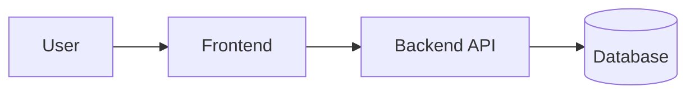

# Diagram Guidelines

Diagrams should clarify architecture, not decorate documentation.

## Default

Use Mermaid as the first diagram format.

Good diagram candidates:

- System boundary
- Module relationships
- Data movement
- User or background workflows
- Request lifecycle

## Rules

1. Every node should represent a real concept from inspected files or user context.
2. Label inferred nodes as inferred in the surrounding text.
3. Keep diagrams small enough to read.
4. Avoid showing implementation details that do not affect architecture.
5. Do not use SVG unless the user asks for it or Mermaid is insufficient.

## Mermaid Style

Prefer simple diagrams:

If a diagram becomes hard to read, split it into multiple diagrams instead of adding more visual complexity.
