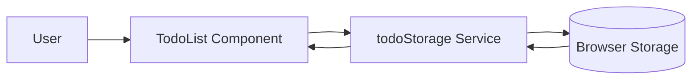

# Data Flow

## Confirmed Data Movement

| Step | Data | Evidence |
| --- | --- | --- |
| User interacts with UI | Todo text and completion state | `TodoList.tsx` described as owning interactions |
| UI calls storage service | Todo records | `todoStorage.ts` described as persistence service |
| Storage service writes local data | Todo records | Browser storage mentioned in observed signals |

## Flow Diagram

## Reasonable Inferences

- Data currently does not leave the browser.
- There is no observed server-side validation, shared persistence, or account-level ownership.

## Open Questions

- Should server data replace local data or synchronize with it?
- What is the expected behavior for existing browser-stored todos after backend adoption?
