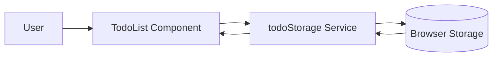

# Data Flow

## Scope

- Project: `basic-web-app`
- Flow: Todo data between UI and local browser persistence.
- Inspection source: Provided file tree and observed signals.

## Inspection Limitations

- Actual source code and runtime state transitions were not inspected.
- The diagram shows an inferred flow from observed responsibilities.
- No backend data flow was observed.

## Confirmed Facts

- `TodoList.tsx` owns todo list rendering and interactions.
- `todoStorage.ts` reads and writes todos to browser storage.
- No backend, database, or API route was observed.

## Confirmed Data Signals

| Step | Data | Evidence |
| --- | --- | --- |
| User interacts with UI | Todo data | `TodoList.tsx` owns interactions. |
| Storage service handles persistence | Todo records | `todoStorage.ts` reads and writes todos. |
| Browser storage stores local data | Todo records | Browser storage is the observed target. |

## Reasonable Inferences

- Data currently does not leave the browser.
- The UI likely reads from and writes to `todoStorage.ts`.
- There is no observed server-side validation, shared persistence, or
  account-level ownership.

## Flow Diagram

## Decisions

- Treat the shown data flow as current local behavior only.
- Do not include backend or database data flow as confirmed.

## Open Questions

- Should server data replace local data or synchronize with it?
- What should happen to existing browser-stored todos after backend adoption?

## Risks

- Remote persistence could conflict with local browser data if sync rules are
  undefined.
- Data migration may be missed if local storage is removed abruptly.

## Next Steps

- Inspect `todoStorage.ts` to confirm storage keys and API shape.
- Decide whether browser storage becomes cache, fallback, or migration source.
