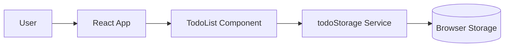

# Module Map

## Confirmed Modules

| Module | Path | Responsibility | Evidence |
| --- | --- | --- | --- |
| Frontend entry | `src/main.tsx` | Mount the React application | Provided context |
| App shell | `src/App.tsx` | Render main UI composition | Provided context |
| Todo component | `src/components/TodoList.tsx` | Render and update todo list interactions | Provided context |
| Todo storage service | `src/services/todoStorage.ts` | Read and write todos to browser storage | Provided context |

## Current Boundary

## Reasonable Inferences

- `todoStorage.ts` is the likely integration point to replace or wrap when backend persistence is introduced.
- UI components should not directly own future API calls if `services/` is already the persistence boundary.

## Open Questions

- Should `todoStorage.ts` become an API client, or should a new service own backend communication?
- Should local browser storage remain as fallback behavior?
