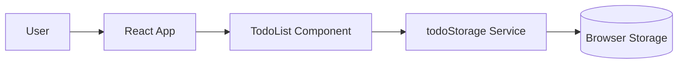

# Module Map

## Scope

- Project: `basic-web-app`
- Requested scope: Map observed modules before adding a backend API.
- Inspection source: Provided file tree and observed signals.

## Inspection Limitations

- Actual imports and call relationships were not inspected.
- Module responsibilities are limited to provided observed signals.

## Confirmed Facts

- `package.json` lists React and Vite.
- `src/main.tsx` mounts the React app.
- `src/App.tsx` renders the main application UI.
- `src/components/TodoList.tsx` owns todo list rendering and interactions.
- `src/services/todoStorage.ts` reads and writes todos to browser storage.
- No backend, database, or API route was observed.

## Confirmed Modules

| Module | Path | Responsibility | Evidence |
| --- | --- | --- | --- |
| Frontend entry | `src/main.tsx` | Mount the React application. | Observed signal. |
| App shell | `src/App.tsx` | Render main UI composition. | Observed signal. |
| Todo component | `src/components/TodoList.tsx` | Render and update todo interactions. | Observed signal. |
| Todo storage service | `src/services/todoStorage.ts` | Read and write todos to browser storage. | Observed signal. |

## Reasonable Inferences

- `todoStorage.ts` is the likely integration point to replace or wrap when
  backend persistence is introduced.
- UI components should probably not own future API calls if `services/` is
  already the persistence boundary.

## Module Diagram

## Decisions

- Treat backend modules as not observed.
- Preserve the current service boundary until actual source files are inspected.

## Open Questions

- Should `todoStorage.ts` become an API client, or should a new service own
  backend communication?
- Should local browser storage remain as fallback behavior?

## Risks

- Adding backend calls directly to UI components may blur module
  responsibilities.
- Replacing `todoStorage.ts` without inspecting callers may break current
  behavior.

## Next Steps

- Inspect imports and call sites.
- Decide persistence ownership before changing module boundaries.
