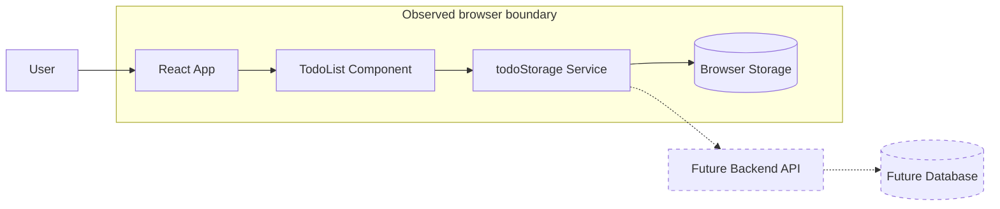

# System Boundary

## Scope

- System name: `basic-web-app`
- Requested scope: Document the architecture before adding a backend API.
- Inspection source: Provided file tree and observed signals.

## Inspection Limitations

- Actual source file contents were not provided in this example.
- Runtime behavior was not executed.
- The boundary map is limited to observed files and stated responsibilities.

## Confirmed Facts

- `package.json` lists React and Vite.
- `src/main.tsx` mounts the React app.
- `src/App.tsx` renders the main application UI.
- `src/components/TodoList.tsx` owns todo list rendering and interactions.
- `src/services/todoStorage.ts` reads and writes todos to browser storage.
- No backend, database, API route, or deployment configuration was observed.

## Reasonable Inferences

- The current system boundary is a browser-based frontend application.
- Browser storage is currently part of the persistence boundary.
- A future backend API would move or split persistence responsibility.

## Inside The Observed System

| Area | Evidence | Notes |
| --- | --- | --- |
| React frontend | `package.json`, `src/main.tsx` | Confirmed as the application runtime surface. |
| App shell | `src/App.tsx` | Confirmed as the main UI composition point. |
| Todo UI | `src/components/TodoList.tsx` | Confirmed as the todo interaction surface. |
| Local persistence service | `src/services/todoStorage.ts` | Confirmed as browser storage access. |
| Browser storage | Observed signal for `todoStorage.ts` | Confirmed storage mechanism in provided context. |

## Outside The Observed System

| External Area | Relationship | Evidence |
| --- | --- | --- |
| Backend API | Requested future addition, not current system | No API route or backend file observed. |
| Database | Possible future dependency, not current system | No database config or schema observed. |
| Deployment platform | Unknown | No deployment configuration observed. |
| Authentication provider | Unknown | No auth files or requirements observed. |

## Unknown Boundary Areas

- Whether the backend will become the source of truth for todos.
- Whether browser storage should remain as cache, fallback, or migration source.
- Whether authentication is required before todos can be stored remotely.
- Where the future backend and database would be deployed.

## Decisions

- Treat backend API and database as future architecture questions, not confirmed
  current components.
- Do not finalize API or database design until persistence ownership is
  clarified.

## Boundary Diagram

## Open Questions

- Should the backend own todo persistence?
- Should browser storage remain part of the system after backend adoption?
- Is authentication required?

## Risks

- Treating the future backend as confirmed would create fake certainty.
- Moving persistence without a migration decision could lose existing local data.

## Next Steps

- Inspect actual source files before implementation.
- Decide persistence ownership before designing backend endpoints.
- Document the new boundary again after backend requirements are confirmed.
