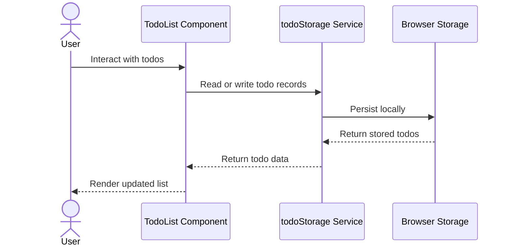

# Workflow Map

## Scope

- Workflow: Current todo interaction and local persistence.
- Requested scope: Document current behavior before adding a backend API.
- Inspection source: Provided file tree and observed signals.

## Inspection Limitations

- Actual function names and event handlers were not inspected.
- The workflow is inferred from stated file responsibilities.
- No backend workflow exists in the observed context.

## Confirmed Facts

- `src/components/TodoList.tsx` owns todo list rendering and interactions.
- `src/services/todoStorage.ts` reads and writes todos to browser storage.
- No backend API was observed.

## Reasonable Inferences

- User todo interactions are handled in the React UI.
- The todo component likely calls or depends on `todoStorage.ts` for
  persistence.
- Todo records likely flow between UI state and browser storage.

## Current Workflow Steps

| Step | Actor | Action | Evidence |
| --- | --- | --- | --- |
| 1 | User | Interacts with the todo UI. | `TodoList.tsx` owns interactions. |
| 2 | Todo UI | Updates todo display or state. | `TodoList.tsx` owns rendering and interactions. |
| 3 | Todo UI | Uses local persistence boundary. | Inference from `todoStorage.ts` responsibility. |
| 4 | Storage service | Reads or writes todo records. | `todoStorage.ts` reads and writes browser storage. |
| 5 | Browser storage | Stores todo records locally. | Browser storage is the observed persistence target. |

## Decisions

- Treat this as a local browser workflow until backend requirements are
  confirmed.
- Do not add remote workflow steps as confirmed behavior.

## Sequence Diagram

## Open Questions

- Which todo interactions exist in the actual code?
- Should a future backend replace or synchronize with browser storage?
- Should failed remote writes keep local changes?

## Risks

- Designing backend workflow before inspecting actual handlers may miss current
  behavior.
- Adding remote persistence without offline rules may create inconsistent data.

## Next Steps

- Inspect `TodoList.tsx` and `todoStorage.ts` before editing workflow code.
- Define backend persistence behavior before adding API calls.
