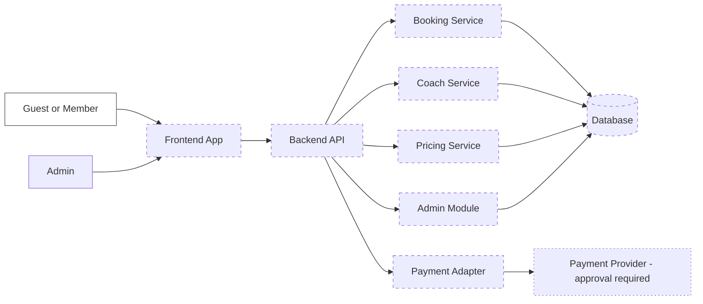

# Architecture Proposal

## Scope

- Idea: Tennis court booking system.
- Mode: Idea-to-Architecture Mode.
- Status: Proposed, not implemented.
- Source: User-provided raw idea.

## User-Provided Facts

- The system needs bookings, coaches, member discounts, payments, and admin
  management.

## Assumptions

- The system is a web application.
- Users can view availability before booking.
- Members are identified so discounts can be applied.
- Payments are processed by an external payment provider.
- Admins manage courts, coaches, pricing, discounts, and booking records.

## Proposed Architecture

Propose a web application with a frontend, backend API, booking service,
pricing and discount service, coach management, payment integration, admin
module, and database.

All components are proposed and require approval before implementation.

## Design Rationale

- A frontend app is proposed because guests, members, and admins need distinct
  interaction surfaces.
- A backend API is proposed to keep booking, pricing, payment, and admin rules
  outside the UI.
- Separate booking, coach, and pricing services are proposed because court
  availability, coach scheduling, and discounts can change independently.
- A payment adapter is proposed to isolate external payment provider details.
- A database is proposed because bookings, members, discounts, and payments need
  durable records.

## Proposed Components

| Component | Responsibility | Status | Rationale |
| --- | --- | --- | --- |
| Frontend app | User and admin UI. | Proposed | Entry point for workflows. |
| Backend API | Coordinates domain actions. | Proposed | Keeps rules outside UI. |
| Booking service | Court availability and bookings. | Proposed | Owns slot lifecycle. |
| Coach service | Coach schedules and assignments. | Proposed | Separates coach rules. |
| Pricing service | Prices and member discounts. | Proposed | Isolates pricing rules. |
| Payment adapter | External payment integration. | Proposed | Isolates provider details. |
| Admin module | Operational management. | Proposed | Protects admin workflows. |
| Database | Durable business records. | Proposed | Stores booking state. |

## Proposed Boundary

## Tradeoffs

- Separate booking and pricing modules keep rules clearer but add coordination.
- External payments reduce payment risk but add provider dependency.
- Member accounts simplify discounts but may increase onboarding friction.

## Open Questions

- Are coach bookings tied to court bookings?
- What booking states are required?
- Which payment provider should be used?
- Are refunds and cancellations in scope?

## Risks

- Booking and payment state may diverge without clear lifecycle rules.
- Discounts may become complex if member tiers or promotions are added later.
- Admin permissions may be too broad without role definitions.

## Decisions Requiring Approval

- Proposed component boundaries.
- Payment-before-confirmation rule.
- Account requirement for members and guests.
- Admin role scope.

## SVG Visual Artifact

Available at `diagram.svg`. Mermaid remains the editable source of truth.

## Next Steps

- Review the proposed boundary.
- Resolve blocking questions.
- Produce an implementation plan only after approval.
