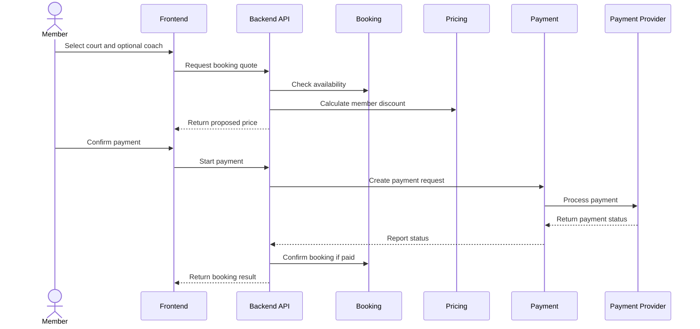

# Workflow Proposal

## Scope

- Workflow: Proposed member booking with discount and payment.
- Mode: Idea-to-Architecture Mode.
- Status: Proposed, not implemented.

## User-Provided Facts

- The system should support bookings, member discounts, payments, and coaches.

## Assumptions

- The member selects a court time and optionally a coach.
- The system calculates a discount before payment.
- Payment is required before the booking is confirmed.

## Proposed Steps

| Step | Actor | Action | Status |
| --- | --- | --- | --- |
| 1 | Member | Selects court time. | Proposed |
| 2 | Member | Optionally selects coach. | Proposed |
| 3 | System | Checks availability. | Proposed |
| 4 | System | Calculates price and discount. | Proposed |
| 5 | Member | Starts payment. | Proposed |
| 6 | Payment provider | Returns payment status. | Proposed |
| 7 | System | Confirms or rejects booking. | Proposed |
| 8 | Admin | Reviews bookings in admin area. | Proposed |

## Proposed Sequence

## Decisions Requiring Approval

- Whether payment must succeed before confirmation.
- Whether coach selection is optional.
- Whether unpaid holds are allowed.

## Open Questions

- How long can a selected slot be held during payment?
- What happens when payment succeeds but booking confirmation fails?
- Are cancellations and refunds part of this workflow?

## Risks

- Race conditions may double-book courts without locking rules.
- Payment failures may leave unclear booking states.
- Discount changes during checkout may confuse members.

## Next Steps

- Define booking lifecycle states.
- Define slot hold duration.
- Decide payment failure and refund behavior.
