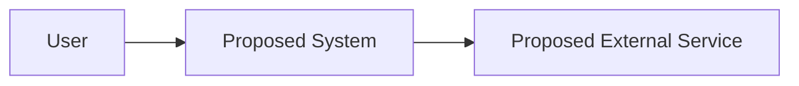

# Architecture Proposal

Purpose: Turn a raw idea into a reviewable proposed architecture.

## Scope

- Idea:
- Proposal status: Proposed
- Source:

## User-Provided Facts

-

## Assumptions

-

## Proposed Architecture

Describe the proposed system in direct, concrete language.

All architecture in this file is proposed until approved.

## Design Rationale

- Explain why each major proposed component exists.
- Tie rationale to user-provided facts, assumptions, or open questions.
- Keep all rationale proposal-level until approved.

## Proposed Components

| Component | Responsibility | Status | Rationale |
| --- | --- | --- | --- |
|  |  | Proposed |  |

## Proposed Boundary

## Tradeoffs

-

## Open Questions

-

## Unknowns

-

## Risks

-

## Decisions Requiring Approval

-

## SVG Visual Artifact

Deferred for v1. Mermaid remains the editable source of truth.

## Next Steps

-
