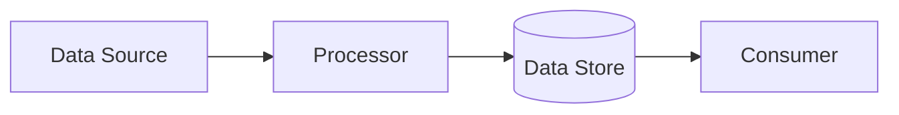

# Data Flow

Purpose: Show how data moves through the observed system.

## Scope

- Workflow or feature:
- Inspection source:

## Confirmed Facts

-

## Reasonable Inferences

-

## Assumptions

-

## Data Sources

| Source | Data | Evidence |
| --- | --- | --- |
|  |  |  |

## Data Stores

| Store | Data Owned | Evidence |
| --- | --- | --- |
|  |  |  |

## Data Consumers

| Consumer | Data Used | Evidence |
| --- | --- | --- |
|  |  |  |

## Flow Diagram

## Unclear Data Movement

-

## Unknowns

-

## Decisions

-

## Open Questions

-

## Risks

-

## Next Steps

-
