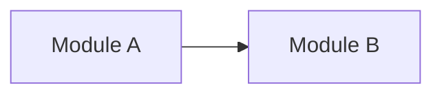

# Module Map

Purpose: Map major modules and their responsibilities.

## Confirmed Modules

| Module | Path | Responsibility | Evidence |
| --- | --- | --- | --- |
|  |  |  |  |

## Reasonable Inferences

-

## Shared Modules

| Module | Path | Shared By | Notes |
| --- | --- | --- | --- |
|  |  |  |  |

## Unclear Modules

| Module | Path | Why Unclear |
| --- | --- | --- |
|  |  |  |

## Decisions

-

## Module Diagram

## Open Questions

-

## Risks

-

## Next Steps

-
