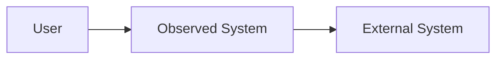

# System Boundary

Purpose: Define what is inside and outside the observed system.

## Scope

- System name:
- Boundary owner:
- Inspection source:

## Confirmed Facts

-

## Reasonable Inferences

-

## Assumptions

-

## Inside The System

| Area | Evidence | Notes |
| --- | --- | --- |
|  |  |  |

## Outside The System

| External System | Relationship | Evidence |
| --- | --- | --- |
|  |  |  |

## Unknown Boundary Areas

-

## Decisions

-

## Boundary Diagram

## Risks

-

## Next Steps

-
