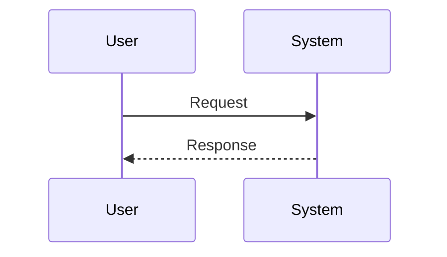

# Workflow Map

Purpose: Document a user, system, or background workflow from trigger to result.

## Workflow

- Name:
- Trigger:
- Result:
- Inspection source:

## Confirmed Facts

-

## Reasonable Inferences

-

## Steps

| Step | Actor | Action | Evidence |
| --- | --- | --- | --- |
| 1 |  |  |  |

## Decisions

-

## Sequence Diagram

## Open Questions

-

## Risks

-

## Next Steps

-
