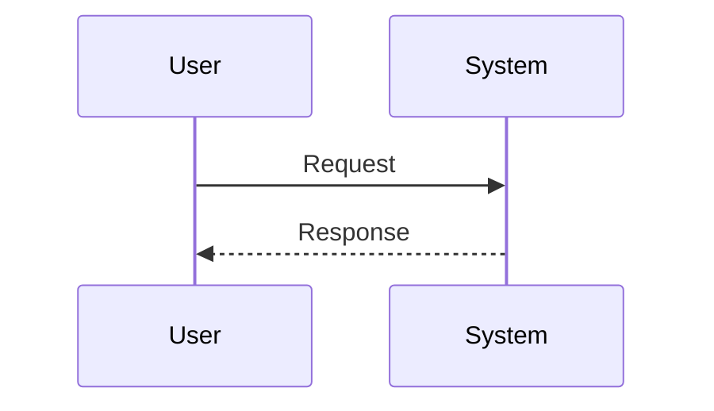

# Workflow Map

Purpose: Document a user, system, or background workflow from trigger to result.

## Workflow

- Name:
- Trigger:
- Result:

## Steps

| Step | Actor | Action | Evidence |
| --- | --- | --- | --- |
| 1 |  |  |  |

## Sequence Diagram

## Open Questions

- 

## Risks

- 
