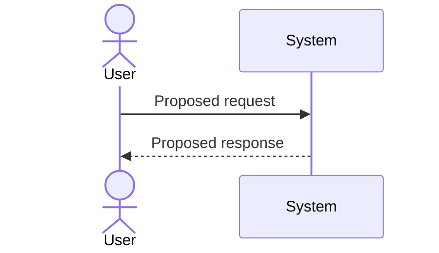

# Workflow Proposal

Purpose: Propose important workflows for a system idea.

## Scope

- Workflow:
- Proposal status: Proposed
- Source:

## User-Provided Facts

-

## Assumptions

-

## Proposed Steps

| Step | Actor | Action | Status |
| --- | --- | --- | --- |
| 1 |  |  | Proposed |

## Proposed Sequence

## Open Questions

-

## Risks

-

## Decisions Requiring Approval

-

## Next Steps

-
